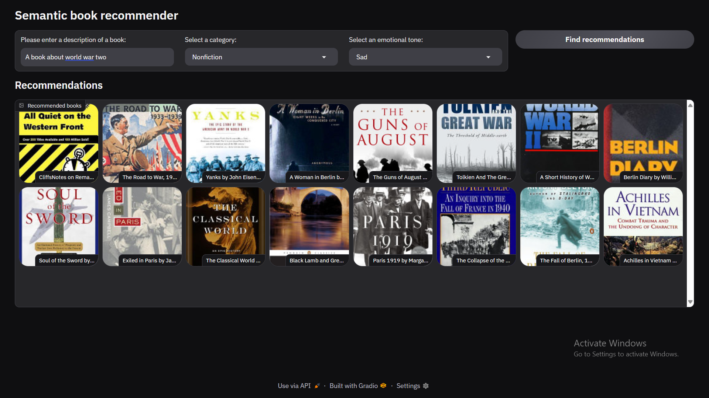

# Semantic Book Recommendation

This project aims to build a semantic book recommendation system using advanced natural language processing techniques.

## Features

- **Zero-Shot Classification**: Utilizes zero-shot classification to categorize book descriptions into fiction and non-fiction without the need for labeled training data. This is achieved using Hugging Face's zero-shot model.
- **Hugging Face Embeddings**: Leverages Hugging Face embeddings for semantic understanding and representation of book descriptions.
- **LangChain Integration**: Implements LangChain for various NLP tasks, including:
  - **Embeddings**: `HuggingFaceEmbeddings` for creating embeddings.
  - **Document Loading**: `TextLoader` for loading text documents.
  - **Vector Stores**: `Chroma` for efficient vector search.
  - **Text Splitting**: `CharacterTextSplitter` for splitting text into manageable chunks.
- **Vector Search**: Enables efficient and accurate retrieval of similar book descriptions using vector search techniques.
- **Semantic Analysis**: Performs semantic analysis to understand the emotions conveyed in book descriptions, categorizing them into six emotions plus neutral.
- **Gradio Interface**: Provides an interactive web interface using Gradio for easy user interaction and book recommendation.
